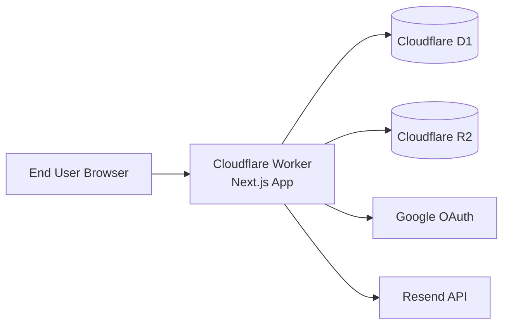
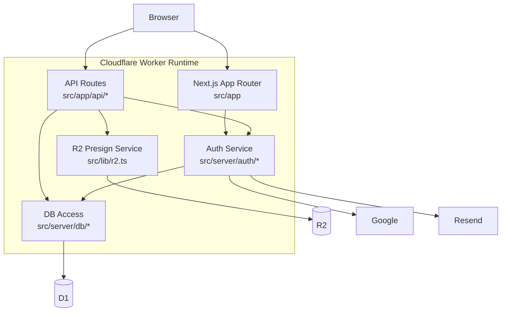

# Architecture

## 1. System Overview
- Purpose:
  - Provide a production-ready SaaS starter running on Cloudflare, with authentication, persistence, storage uploads, and deploy tooling pre-wired.
- Primary goals:
  - Fast bootstrap for new SaaS features.
  - Cloudflare-native runtime (Workers + D1 + R2).
  - Minimal friction between local dev and deployed environments.
- Success criteria:
  - User can sign in with Google OAuth or email magic link.
  - Authenticated user can access protected routes and API endpoints.
  - App can persist user settings in D1 and issue signed upload URLs for R2.
  - Project can be configured via setup script and deployed through OpenNext + Wrangler.
- Non-goals:
  - Not a multi-tenant authorization system.
  - Not a full domain-driven enterprise platform.
  - Not a generic file management product (upload presign only).

## 2. Architectural Style
- Chosen style: `Layered + Vertical Slice (App Router route groups as slices)`.
- Why this style fits:
  - Next.js App Router naturally organizes UI/routes per feature slice.
  - Shared infrastructure concerns (auth/db/storage/config) are centralized in `src/server` and `src/lib`.
  - Keeps feature delivery fast while preventing direct UI -> infra coupling.
- Layer intent:
  - Presentation: `src/app`, `src/components`, `src/hooks`.
  - Application/Orchestration: route handlers and server pages using `auth()` and `getDb()`.
  - Infrastructure: `src/server/auth`, `src/server/db`, `src/lib/r2`, Cloudflare bindings.

## 3. Domain Model and Modules
- `Identity & Session`:
  - Owns login flows, user session hydration, provider integration (Google, Resend).
  - Files: `src/server/auth.ts`, `src/server/auth/base.ts`, `src/app/api/[...nextauth]/route.ts`.
- `Access Control`:
  - Enforces route/API access gates via inline `auth()` checks in layouts and route handlers.
  - Files: `src/app/(authenticated)/layout.tsx`, `src/app/(unauthenticated)/(auth)/layout.tsx`, API route handlers.
- `User Profile & Preferences`:
  - Persists and reads user settings (`user_settings`), exposes settings API.
  - Files: `src/app/api/settings/route.ts`, `src/server/db/schema.ts`.
- `File Upload Capability`:
  - Creates short-lived presigned upload URLs for direct-to-R2 upload.
  - Files: `src/lib/r2.ts`, `src/app/api/upload/presign/route.ts`.
- `UI Shell`:
  - Public landing, auth pages, authenticated shell with sidebar/header/theme toggle.
  - Files under `src/app/(unauthenticated)` and `src/app/(authenticated)`.
- Ownership boundaries:
  - Only `src/server/*` and `src/lib/r2.ts` may talk to Cloudflare resources directly.
  - Route handlers/pages consume exported server APIs, not raw bindings.

## 4. Directory Layout
- Top-level:
  - `src/app`: App Router pages, layouts, API routes.
  - `src/server`: server-side auth and database adapters/schemas.
  - `src/lib`: infrastructure helpers (R2 presign, theme script).
  - `src/components`: reusable UI components.
  - `drizzle`: SQL migrations and metadata.
  - `scripts`: setup/bootstrap automation.
  - `wrangler.toml`: Worker deployment and resource bindings.
- Rules:
  - DB schema changes must happen in `src/server/db/schema.ts` and corresponding `drizzle` migration.
  - API route handlers must enforce auth (except explicit public routes).
  - UI components must not access Cloudflare bindings directly.
  - Environment access must flow through validated env (`src/env.ts`) or Cloudflare runtime env.

## 5. Data Flow and Boundaries
- Login flow:
  - Browser -> `/login` -> `next-auth` sign-in (`google` or `resend`) -> callbacks in `createAuth` -> JWT session -> protected routes allowed.
- Protected page flow (`/dashboard`, `/settings`):
  - Browser request -> `(authenticated)/layout.tsx` calls `auth()` -> render authenticated UI or redirect `/login`.
- Auth page flow (`/login`):
  - Browser request -> `(unauthenticated)/(auth)/layout.tsx` calls `auth()` -> redirect `/dashboard` if logged in, else render auth UI.
- Settings API flow:
  - Client/Server call -> `PATCH /api/settings` -> `auth()` check -> validate with Zod -> upsert `user_settings` with Drizzle -> JSON response.
- Upload presign flow:
  - Client call -> `POST /api/upload/presign` -> `auth()` check -> validate with Zod -> generate signed PUT URL via `aws4fetch` -> return URL/key/expires.
- Boundaries:
  - Validation boundary: route handlers validate external input with Zod.
  - Auth boundary: `auth()` in layouts and route handlers acts as gatekeeper.
  - Persistence boundary: only Drizzle queries in server layer.

## 6. Cross-Cutting Concerns
- Authn/Authz:
  - NextAuth v5 beta with Google + Resend providers.
  - Session strategy is JWT; user role attached to session in callback.
  - Layouts and route handlers enforce access via inline `auth()` checks.
- Logging/Observability:
  - Minimal explicit logging today; errors rely on framework defaults.
  - Recommendation: add structured logs in API handlers and auth callbacks.
- Error handling:
  - API returns explicit `401`/`400`; unexpected errors currently bubble.
  - Recommendation: standardize error envelope (`code`, `message`, `requestId`).
- Configuration and secrets:
  - `src/env.ts` enforces required server env vars.
  - Runtime Cloudflare bindings via `getCloudflareContext().env`.
  - Setup script generates `.dev.vars` and patches `wrangler.toml`.

## 7. Data and Integrations
- Datastores:
  - Cloudflare D1 (SQLite) via Drizzle ORM.
  - Tables:
    - Auth: `user`, `account`, `session`, `verificationToken`.
    - App: `user_settings`.
- External services:
  - Google OAuth for social login.
  - Resend for magic link email delivery.
  - Cloudflare R2 for object storage; presigned upload URLs generated server-side.
- Integration patterns:
  - Adapter pattern for auth persistence (`DrizzleAdapter`).
  - Repository-lite access through `getDb()` and schema exports.
  - Runtime binding abstraction through Cloudflare context with dev fallback.

## 8. Deployment and Environments
- Runtime and hosting:
  - Next.js built with `@opennextjs/cloudflare`, deployed as Cloudflare Worker.
- Environments:
  - Development:
    - Uses local Wrangler D1 sqlite file via `better-sqlite3`.
    - Env from `.dev.vars` with validation fallback.
  - Production:
    - Uses Cloudflare `DATABASE` D1 binding and `STORAGE` R2 binding.
    - Secrets/config expected in Cloudflare environment.
- Release strategy:
  - `bun run cf:build` then `bun run deploy` (`opennextjs-cloudflare deploy`).
  - Schema migrations managed via Drizzle + Wrangler D1 execute commands.

## 9. Key Design Decisions
1. Use App Router route groups to separate authenticated vs unauthenticated surfaces.
   - Trade-off: simpler navigation/security boundaries, but route-level conventions must be maintained.
2. Centralize auth in `createAuth` and re-export helpers from `src/server/auth.ts`.
   - Trade-off: single auth source of truth, but tight coupling to NextAuth callback model.
3. Use JWT sessions with DB adapter-backed identity tables.
   - Trade-off: stateless session checks and portability, but token contents must be curated carefully.
4. Use `getDb()` abstraction with dev/prod branching.
   - Trade-off: unified DB call site, but environment behavior differs and must stay tested.
5. Keep API validation at handler boundary with Zod.
   - Trade-off: consistent input contracts, but duplicated schema definitions across handlers.
6. Generate R2 upload URLs server-side instead of proxying file uploads through app server.
   - Trade-off: reduced server bandwidth/cost, but requires strict key naming and credential hygiene.
7. Enforce auth inline in layouts and route handlers instead of middleware.
   - Trade-off: single source of truth (`auth()`), no cookie heuristic drift, but each new protected route must remember to check.
8. R2 bucket name sourced from setup flow (wrangler.toml `bucket_name`), presign helper should read from config not hardcode.
9. Inline error responses (`{ error: "..." }`) over shared typed error format — current scale doesn't justify the abstraction.
10. Role field on session exists for consumers; template enforces route-level auth only.
11. Theme uses localStorage-first (avoids FOUC, works without auth); `/api/settings` is for other user preferences.

## 10. Diagrams (Mermaid)

## 11. Forbidden Patterns
- Do not call Cloudflare bindings directly from client components.
- Do not query D1 directly from `src/app` UI files; go through server layer.
- Do not bypass Zod validation for mutable API endpoints.
- Do not add new protected routes without inline `auth()` checks in layout or handler.
- Do not hardcode production secrets or IDs in source files.
- Do not duplicate auth/session logic outside `src/server/auth/*`.

## 12. Open Questions
- None currently open.

## Assumptions
- This document describes the current architecture in the repository as of February 11, 2026.
- Single app instance and single D1 database are assumed per deployment environment.
